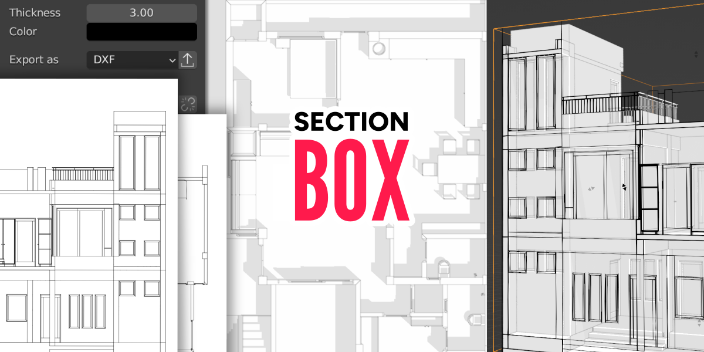

===========
Section Box
===========

**Section Box** is the most complete Blender addon for creating cross sections for architecture visualization, product designs and more.
Show your projects from every angle, place and distance no matter how complex they are.

########
Features
########

* Instantiate Section Boxes around selected objects, collections or wherever you want.
* Create cross sections and elevations easier then ever before, with their DXF one click away.
* Take full control with dynamic gizmos and an organized menu.
* Choose a section method based on your priorities like look, mode and performance.
* Save different section box states as views and go back to them whenever you want.
* Keyframe any setting you need to produce everything you want.

#######
Support
#######

If you have any questions get in touch via :doc:`contact`.

########
Contents
########

.. toctree::
    :maxdepth: 2
    
    installation
    manage
    transform
    menu
    settings
    preferences
    update
    changelog
    contact