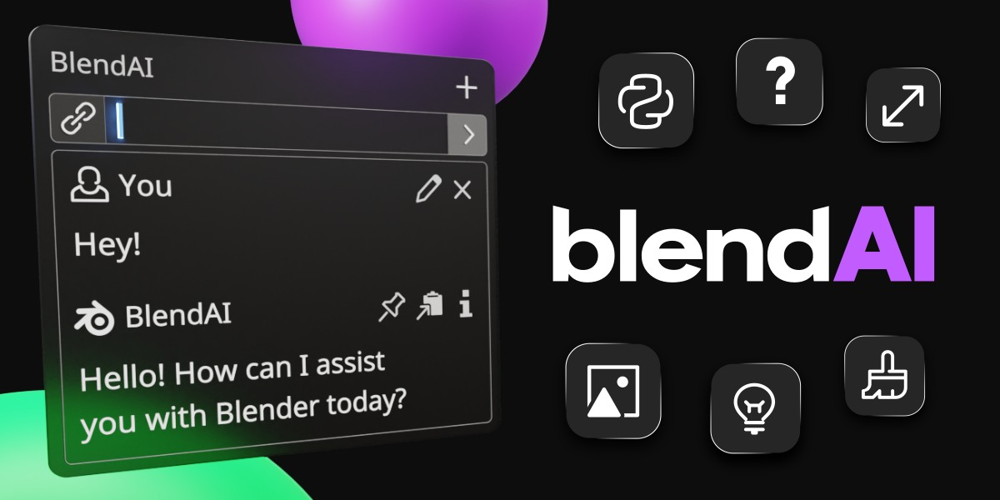

%%%%%%%%%%%%%%%%%%%%%
BlendAI Documentation
%%%%%%%%%%%%%%%%%%%%%

Welcome to the BlendAI documentation! Here you will find everything you need to know about BlendAI and how to use it in Blender.

========
Contents
========

.. toctree::
    :caption: Getting Started
    :maxdepth: 1
    
    introduction
    installation
    update
    main_panel
    preferences
    credits
    limitations

.. toctree::
    :caption: Features
    :maxdepth: 1

    features/chat
    features/explain
    features/organize
    features/generate_script
    features/edit_script
    features/fix_script
    features/test_script
    features/save_script_preset
    features/render_suggestions
    features/reference_images
    features/texture_generation
    features/upscale_image
    features/inpaint_image
    
.. toctree::
    :caption: News & Support
    :maxdepth: 1

    changelog
    contact